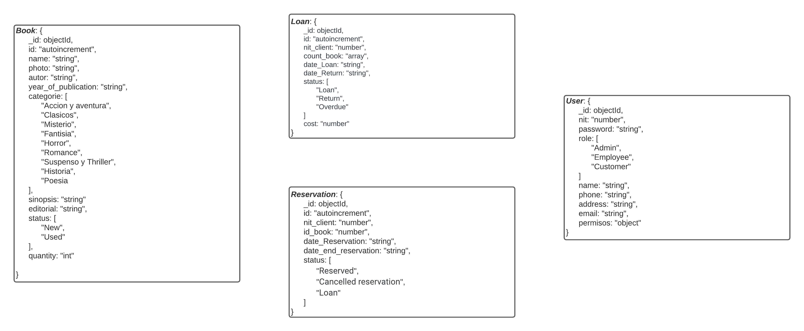

## OBJETIVO GENERAL

El principal objetivo de este sistema es facilitar y mejorar el proceso de préstamo de libros, así como garantizar el acceso equitativo a los recursos bibliográficos mediante la implementación de reservas.

Además, este sistema busca minimizar la pérdida o extravío de libros manteniendo un registro exhaustivo de los libros prestados, fechas de vencimiento y multas en caso de retrasos. Esto contribuye a un control eficaz de los recursos y a una gestión eficiente de la biblioteca en su conjunto.

<<<<<<< HEAD


=======
>>>>>>> main
## OBJETIVOS ESPECÍFICOS

- Implementar un sistema de gestión de inventario que permita mantener un registro actualizado de todos los libros disponibles en la biblioteca, incluyendo información detallada de cada libro, como título, autor, descripción y categoría.
- Proporcionar una interfaz de administración para que el personal de la biblioteca agregue, modifique o elimine registros de libros, actualice el estado de los préstamos y las reservas.
- Realizar pruebas exhaustivas del sistema antes de su total implementación para asegurar su funcionalidad y confiabilidad, corrigiendo posibles errores o problemas identificados durante el proceso de prueba.

#### CARACTERÍSTICAS:

- Posibilidad de prestar libros.
- Los usuarios pueden buscar en el catálogo en línea.
- El sistema mantiene un registro actualizado de los libros prestados, fechas de vencimiento y multas en caso de retrasos, esto asegura un control efectivo de los recursos y evita la pérdida o extravío de los libros.
- Además de los préstamos, el sistema permite a los usuarios realizar reservas de libros que se encuentran actualmente en préstamo. En el caso de que el usuario acuda a la biblioteca a buscar un libro y este no esté disponible, se notificará a los usuarios cuando esté disponible. para la colección, esto facilita el acceso equitativo a los libros más solicitados y garantiza una distribución justa.


# DIAGRAMA

<<<<<<< HEAD



# INSTALACIÓN

**1**. Asegurate de tener Node.js instalado en tu computadora. De no ser así, descargalo e instala [Node js](https://nodejs.org/es/download)

 **NOTA**: Tener instalado la versión de nvm 18.17.1 para ejecutar este proyecto.

- Si no sabes como instalar esta versión sigue los siguientes pasos:
  - Abre la terminal en la pantalla de inicio.
  - Ejecuta el comando `node -v` para saber que versión tienes.
  - Si tienes una versión anterior a la 18.16.1 se recomienda instalar versión "18.17.1".
  - Para listar todas las versiones disponibles ejecuta este comando "nvm ls-remote".
  - Para instalar la versión mas reciente sigue estos pasos
    - nvm install 18.17.1

**2**. Clona este repositorio en tu computadora, utiliza el siguiente comando:

```
git clone 
```

**3**. Instala las dependecias necesarias con el siguiente comando.

```
npm install
```

**4**. Configura tus variables de entorno

- Crea un archivo .env en la carpeta principal del proyecto si el proyecto no cuanta con un archivo, y pon las siguiente variables con los respectivos datos.

```
VITE_MY_CONFIG = {"hostname": "127.10.10.10", "port": 5130}
VITE_PORT_FRONTEND = 5129
VITE_MY_CONNECT = {"user": "Jhon", "password": "123", "database": "Books-Corner-Proyect"}
VITE_MY_JWT = ""
```

**NOTA:** Hostname para el cluster "192.168.129.72"

**5**. Abre la terminal y ejecuta el servidor y el react vite con los siguientes comandos

```
npm run dev
```

```
npm run server
```


## APARTADOS FRONTEND

1. **HOME:**
   - Va a poder encontrar las siguientes cosas:
     - Titulo de bienvenida
     - Acerca de: "en este caso la libreria"
       - Misión
       - Visión
       - Objetivo
     - Libros mas vistos "Top 3"
     - Formulario de contacto
2. **CATALOGUE:**
   - Libros que hay en la biblioteca, puede investigar su libro preferido y asistir personalmente para un prestamo
3. **LOGIN**
   - Va a poder encontrar las siguientes cosas
     - Formulario de registro de usuario "Solo rol **Customer**"
     - Formulario inicio de sesión


## INICIO DE SESIÓN BACKEND

1. Para iniciar sesion en el backend abre el editor de codigo de tu preferencia, en este caso **"visual studio code"**
2. Descarga la extensión de **Thunder Client**

3. Abre la extension de **Thunder Client** y en el header pon la siguiente ruta el metodo de la consulta es **POST**

   ```
   http://127.10.10.10:5130/login
   ```

4. En el body coloca el siguiente objeto 

   ```
    {
        "user": 1234567890,
        "pass": "password123"
    }
   ```

​	**NOTA:** Le va a arrojar una respuesta, copia lo que viene en el **message** ------> Bearer + token	

  - Hay 3 tipos de usuarios:
    - Admin
    - Employee
    - Customer

```
1. {
  "user": 1234567890,
  "pass": "password123"
}

2. {
  "user": 9876543210,
  "pass": "password456"
}

3. {
  "user": 3333333333,
  "pass": "password789"
}
```


## INICIO DE SESIÓN FRONTEND

1. Para iniciar sesion en el frontend abre el navegador de tu preferencia y escribe la siguiente url 

   ```
   http://127.10.10.10:5129/home
   ```

   En el caso de ya tenerlo desplegado en el cluster, escribir la siguiente url

   ```
   http://192.168.129.72:5129/home
   ```

2. Dirigete a la parte superior derecha de la página web y dale clic en **"Login"**
3. Hay 3 tipos de usuarios:
   - Admin
   - Employee
   - Customer

```
1. {
  "user": 1234567890,
  "pass": "password123"
}

2. {
  "user": 9876543210,
  "pass": "password456"
}

3. {
  "user": 3333333333,
  "pass": "password789"
}
```

4. En caso de no estar registrado, dale clic sobre el circulo que aparece debajo de los titulo de **"Login" - "Sign Up"**

   - Le va a desplegar un menú de registro, ese registro solo es para clientes, en caso de ser empleado, contactar con el administrador para que haga su respectivo registro.

5. Una vez que tenga un usuario y una contraseña, digitarlos en el formulario de **"Login"** para ingresar a sus funciones

   **NOTA:** Recuerde, en el registro de usuario, colocar datos reales y que no contengan ningun espacio al final.


## ENDPOINTS BACKEND

1. Para hacer las diferentes operaciones en el backend, una vez iniciada sesión y teniendo el token, haga los siguientes pasos

   1. Copia el token y dirigete al apartado de **"Thunder Client"** en donde dice **"Headers"**

   2. Una vez allí agrega una casilla que se llame **"Authorization"** y pega el token ahí y otra que se llame **"Accept-Version"** y pon la version correspondiente a su usuario

      - Versiones:
        - 1. Administrador: **"3.0.0"**
          2. Empleado: **"2.0.0"**
          3. Customer: **"1.0.0"**

   3. Una vez echo los pasos, podras realizar las operaciones pertinentes a su perfil

      

### ADMINISTRADOR

**"Usuarios"**

  1. Consultar usuarios por nombre **"GET"**

     ```
     http://127.10.10.10:5130/user/name/"nombre del usuario"
     ```

  2. Consultar usuarios por NIT **"GET"**

     ```
     http://127.10.10.10:5130/user/consultar/id/"nit del usuario"
     ```

     **"Funciones"**

     	- Agregar usuarios
     	- Editar usuarios
     	- Eliminar usuarios

     1. Para agregar un usuario con rol de Employee, en el header colocar la siguiente ruta **"POST"**

        ```
        http://127.10.10.10:5130/user/postEmployee
        ```

        y en body el siguiente objeto

        ```
        {
            "nit": 1102391491,
            "password": "123.0.",
            "role": "Employee",
            "name": "Jhon Hernandez",
            "phone": "+57 3005559677",
            "address": "Calle 11B # 1A - 20",
            "email": "Jhon.1899@gmail"
        }
        ```

     
     2. Para agregar un usuario con el rol de Customer, en el header colocar la siguiente ruta **"POST"**
     
        ```
        http://127.10.10.10:5130/user/postCustomer
        ```
     
        y en body el siguiente objeto
     
        ```
        {
            "nit": 1102312223,
            "password": "1234",
            "role": "Customer",
            "name": "Nicolas Caicedo",
            "phone": "+57 3102312223",
            "address": "Calle 1B # 1A - 20 SanFrancisco",
            "email": "Nicolas@gmail"
        }
        ```
     
     
     3. Para actualizar un usuario, en el header coloca la siguiente ruta **"PUT"**
     
        ```
        http://127.10.10.10:5130/user/update/"nit del usuario"
        ```
     
        y en body el siguiente objeto, "cambia los datos que veas necesario"
     
        ```
        {
            "nit": 1102312223,
            "password": "1234",
            "role": "Customer",
            "name": "Nicolas Caicedo",
            "phone": "+57 3102312223",
            "address": "Calle 1B # 1A - 20 SanFrancisco",
            "email": "Nicolas@gmail"
        }
        ```
     
     4. Para eliminar un usuario, en el header coloca la siguiente ruta **"DELETE"**
     
        ```
        http://127.10.10.10:5130/user/delete/"nit del usuario"
        ```


**"Libros"**

1. Consultar libro por id **"GET"**

   ```
   http://127.10.10.10:5130/book/id/"id del libro"
   ```

2. Consultar libro por nombre **"GET"**

   ```
   http://127.10.10.10:5130/book/name/"nombre del libro"
   ```

3. Consultar libro por autor **"GET"**

   ```
   http://127.10.10.10:5130/book/author/"autor del libro"
   ```

4. Consultar libro por categoria **"GET"**

   ```
   http://127.10.10.10:5130/book/categorie/"categoria del libro"
   ```

5. Consultar libro por editorial **"GET"**

   ```
   http://127.10.10.10:5130/book/editorial/"editorial del libro"
   ```

   **"Funciones"**
   
   ```
   - Agregar libros
   - Editar libros
   - Eliminar libros
   ```
   
    1. Para agregar un libro, en el header colocar la siguiente ruta **"POST"**
   
       ```
       http://127.10.10.10:5130/book
       ```
   
       y en body el siguiente objeto
   
       ```
        {
            "id": 1,
            "name": "El Señor de los Anillos: LComunidad del Anillo",
            "photo": "https://www.lamusica.com.ccdn/shop/products/img20221006_1516598jpg?v=1665087589",
            "autor": "J.R.R. Tolkien",
            "yearOfPublication": "1954",
            "categorie": "Fantasia",
            "sinopsis": "El Señor de los Anilloes una trilogía de novelas de fantasíescrita por el filólogo y escritobritánico J. R. R. Tolkien. Lhistoria se desarrolla en la TierrMedia, un continente ficticio pobladpor elfos, enanos, hobbits y hombresLa trilogía narra el viaje del hobbiFrodo Bolsón para destruir el AnillÚnico, una poderosa arma forjada poel Señor Oscuro Sauron.",
            "editorial": "HarperCollins",
            "status": "New",
            "quantity": 10
        }
       ```
       
   2. Para actualizar un libro, en el header coloca la siguiente ruta **"PUT"**
   
      ```
      http://127.10.10.10:5130/book/update/"id del libro"
      ```
   
      y en body el siguiente objeto, "cambia los datos que veas necesario"
   
      ```
        { 
            "name": "El Señor : La Comunidad deAnillo",
            "photo": "https://www.lamusica.com.ccdn/shop/products/img20221006_1516598jpg?v=1665087589",
            "autor": "J.R.R. Tolkien",
            "year_of_publication": "1954",
            "categorie": "Fantasia",
            "sinopsis": "El Señor de los Anillos euna trilogía de novelas de fantasíescrita por el filólogo y escritobritánico J. R. R. Tolkien. La historise desarrolla en la Tierra Media, ucontinente ficticio poblado por elfosenanos, hobbits y hombres. La trilogínarra el viaje del hobbit Frodo Bolsópara destruir el Anillo Único, unpoderosa arma forjada por el SeñoOscuro Sauron.",
            "editorial": "HarperCollins",
            "status": "New",
            "quantity": 10
        }
      ```
   
   3. Para eliminar un libro, en el header coloca la siguiente ruta **"DELETE"**
   
      ```
      http://127.10.10.10:5130/book/delete/"id del libro"
      ```
   


**"Prestamos"**

1. Consultar prestamos por id **"GET"**

   ```
   http://127.10.10.10:5130/loan/getIdLoan/"id de prestamo"
   ```

2. Consultar prestamos por nit**"GET"**

   ```
   http://127.10.10.10:5130/loan/getNitLoan/"nit del cliente"
   ```

3. Consultar prestamos por fecha de prestamo **"GET"**

   ```
   http://127.10.10.10:5130/loan/getLoanDate/"fecha del prestamo"
   ```

4. Consultar prestamos por fecha de devolución **"GET"**

   ```
   http://127.10.10.10:5130/loan/getLoanReturnDate/"fecha del devolución"
   ```

5. Consultar prestamos por estado**"GET"**

   ```
   http://127.10.10.10:5130/loan/getStateLoan/"estado del prestamo"
   ```

   **"Funciones"**

   ```
   - Agregar prestamos
   - Editar prestamos
   - Eliminar prestamos
   ```

   1. Para agregar un prestamo, en el header colocar la siguiente ruta **"POST"**

      ```
      http://127.10.10.10:5130/loan/
      ```

      y en body el siguiente objeto

      ```
        {
            "nit_client": 1111111111,
            "count_book": [4],
            "date_return": "2024-05-19",
            "status": "Loan",
            "cost": 0
        }
      ```

   
   2. Para actualizar un prestamo, en el header coloca la siguiente ruta **"PUT"**
   
      ```
      http://127.10.10.10:5130/loan/update/"id del prestamo"
      ```
   
      y en body el siguiente objeto, "cambia los datos que veas necesario"
   
      ```
        {
            "nit_client": 1111111111,
            "count_book": [4],
            "date_return": "2024-05-19",
            "status": "Loan",
            "cost": 0
        }
      ```
   
   3. Para eliminar un prestamo, en el header coloca la siguiente ruta **"DELETE"**
   
      ```
      http://127.10.10.10:5130/loan/delete/"id del prestamo"
      ```
   
      

**"Reservas"**

1. Consultar reservas por id **"GET"**

   ```
   http://127.10.10.10:5130/reservation/consultarId/"id de prestamo"
   ```

2. Consultar reservas por nit**"GET"**

   ```
   http://127.10.10.10:5130/reservation/nit/"nit del cliente"
   ```

3. Consultar reservas por fecha de reserva **"GET"**

   ```
   http://127.10.10.10:5130/reservation/date/"fecha del prestamo"
   ```

4. Consultar reservas por estado**"GET"**

   ```
   http://127.10.10.10:5130/reservation/statu/"estado del prestamo"
   ```

   **"Funciones"**

   ```
   - Agregar reservas
   - Editar reservas
   - Eliminar reservas
   ```

   1. Para agregar una reserva, en el header colocar la siguiente ruta **"POST"**

      ```
      http://127.10.10.10:5130/reservation/
      ```

      y en body el siguiente objeto

      ```
        {
            "nit_client": 1234567890,
            "id_book": 19,
            "date_reservation": "2024-06-26",
            "date_end_reservation": "2024-06-26",
            "status": "Reserved"
        }
      ```

   2. Para actualizar una reserva, en el header coloca la siguiente ruta **"PUT"**

      ```
      http://127.10.10.10:5130/reservation/update/"id de la reserva"
      ```

      y en body el siguiente objeto, "cambia los datos que veas necesario"

      ```
        {
            "nit_client": 1111111111,
            "count_book": [4],
            "date_return": "2024-05-19",
            "status": "Loan",
            "cost": 0
        }
      ```

   3. Para eliminar una reserva, en el header coloca la siguiente ruta **"DELETE"**

      ```
      http://127.10.10.10:5130/reservation/delete/"id de la reserva"
      ```

      


### EMPLOYEE

**"Usuarios"**

  1. Consultar usuarios por nombre **"GET"**

     ```
     http://127.10.10.10:5130/user/name/"nombre del usuario"
     ```

  2. Consultar usuarios por NIT **"GET"**

     ```
     http://127.10.10.10:5130/user/consultar/id/"nit del usuario"
     ```

     **"Funciones"**

     ```
     - Agregar usuarios
     - Editar usuarios
     ```
     
     1. Para agregar un usuario con el rol de Customer, en el header colocar la siguiente ruta **"POST"**
     
        ```
        http://127.10.10.10:5130/user/postCustomer
        ```
     
        y en body el siguiente objeto
     
        ```
        {
            "nit": 1102312223,
            "password": "1234",
            "role": "Customer",
            "name": "Nicolas Caicedo",
            "phone": "+57 3102312223",
            "address": "Calle 1B # 1A - 20 SanFrancisco",
            "email": "Nicolas@gmail"
        }
        ```
     
     2. Para actualizar un usuario, en el header coloca la siguiente ruta **"PUT"**
     
        ```
        http://127.10.10.10:5130/user/update/"nit del usuario"
        ```
     
        y en body el siguiente objeto, "cambia los datos que veas necesario"
     
        ```
        {
            "nit": 1102312223,
            "password": "1234",
            "role": "Customer",
            "name": "Nicolas Caicedo",
            "phone": "+57 3102312223",
            "address": "Calle 1B # 1A - 20 SanFrancisco",
            "email": "Nicolas@gmail"
        }
        ```


**"Libros"**

1. Consultar libro por id **"GET"**

   ```
   http://127.10.10.10:5130/book/id/"id del libro"
   ```

2. Consultar libro por nombre **"GET"**

   ```
   http://127.10.10.10:5130/book/name/"nombre del libro"
   ```

3. Consultar libro por categoria **"GET"**

   ```
   http://127.10.10.10:5130/book/categorie/"categoria del libro"
   ```
   
   **"Funciones"**
   
   ```
   - Agregar libros
   - Editar libros
   ```
   
   1. Para agregar un libro, en el header colocar la siguiente ruta **"POST"**
   
      ```
      http://127.10.10.10:5130/book/
      ```
   
      y en body el siguiente objeto
   
      ```
        {
            "id": 1,
            "name": "El Señor de los Anillos: LComunidad del Anillo",
            "photo": "https://www.lamusica.com.ccdn/shop/products/img20221006_1516598jpg?v=1665087589",
            "autor": "J.R.R. Tolkien",
            "yearOfPublication": "1954",
            "categorie": "Fantasia",
            "sinopsis": "El Señor de los Anilloes una trilogía de novelas de fantasíescrita por el filólogo y escritobritánico J. R. R. Tolkien. Lhistoria se desarrolla en la TierrMedia, un continente ficticio pobladpor elfos, enanos, hobbits y hombresLa trilogía narra el viaje del hobbiFrodo Bolsón para destruir el AnillÚnico, una poderosa arma forjada poel Señor Oscuro Sauron.",
            "editorial": "HarperCollins",
            "status": "New",
            "quantity": 10
        }
      ```
   
   2. Para actualizar un libro, en el header coloca la siguiente ruta **"PUT"**
   
      ```
      http://127.10.10.10:5130/book/update/"id del libro"
      ```
   
      y en body el siguiente objeto, "cambia los datos que veas necesario"
   
      ```
        { 
            "name": "El Señor : La Comunidad deAnillo",
            "photo": "https://www.lamusica.com.ccdn/shop/products/img20221006_1516598jpg?v=1665087589",
            "autor": "J.R.R. Tolkien",
            "year_of_publication": "1954",
            "categorie": "Fantasia",
            "sinopsis": "El Señor de los Anillos euna trilogía de novelas de fantasíescrita por el filólogo y escritobritánico J. R. R. Tolkien. La historise desarrolla en la Tierra Media, ucontinente ficticio poblado por elfosenanos, hobbits y hombres. La trilogínarra el viaje del hobbit Frodo Bolsópara destruir el Anillo Único, unpoderosa arma forjada por el SeñoOscuro Sauron.",
            "editorial": "HarperCollins",
            "status": "New",
            "quantity": 10
        }
      ```
   


**"Prestamos"**

1. Consultar prestamos por id **"GET"**

   ```
   http://127.10.10.10:5130/loan/getIdLoan/"id de prestamo"
   ```

2. Consultar prestamos por nit**"GET"**

   ```
   http://127.10.10.10:5130/loan/getNitLoan/"nit del cliente"
   ```

3. Consultar prestamos por fecha de prestamo **"GET"**

   ```
   http://127.10.10.10:5130/loan/getLoanDate/"fecha del prestamo"
   ```

4. Consultar prestamos por fecha de devolución **"GET"**

   ```
   http://127.10.10.10:5130/loan/getLoanReturnDate/"fecha del devolución"
   ```

5. Consultar prestamos por estado**"GET"**

   ```
   http://127.10.10.10:5130/loan/getStateLoan/"estado del prestamo"
   ```

   **"Funciones"**

   ```
   - Agregar prestamos
   - Editar prestamos
   ```

   1. Para agregar un prestamo, en el header colocar la siguiente ruta **"POST"**

      ```
      http://127.10.10.10:5130/loan/
      ```

      y en body el siguiente objeto

      ```
        {
            "nit_client": 1111111111,
            "count_book": [4],
            "date_return": "2024-05-19",
            "status": "Loan",
            "cost": 0
        }
      ```


   2. Para actualizar un prestamo, en el header coloca la siguiente ruta **"PUT"**

      ```
      http://127.10.10.10:5130/loan/update/"id del prestamo"
      ```

      y en body el siguiente objeto, "cambia los datos que veas necesario"

      ```
        {
            "nit_client": 1111111111,
            "count_book": [4],
            "date_return": "2024-05-19",
            "status": "Loan",
            "cost": 0
        }
      ```

      

**"Reservas"**

1. Consultar reservas por id **"GET"**

   ```
   http://127.10.10.10:5130/reservation/consultarId/"id de prestamo"
   ```

2. Consultar reservas por nit**"GET"**

   ```
   http://127.10.10.10:5130/reservation/nit/"nit del cliente"
   ```

3. Consultar reservas por fecha de reserva **"GET"**

   ```
   http://127.10.10.10:5130/reservation/date/"fecha del prestamo"
   ```

4. Consultar reservas por estado**"GET"**

   ```
   http://127.10.10.10:5130/reservation/statu/"estado del prestamo"
   ```

   **"Funciones"**

   ```
   - Agregar reservas
   - Editar reservas
   ```

   1. Para agregar una reserva, en el header colocar la siguiente ruta **"POST"**

      ```
      http://127.10.10.10:5130/reservation/
      ```

      y en body el siguiente objeto

      ```
        {
            "nit_client": 1234567890,
            "id_book": 19,
            "date_reservation": "2024-06-26",
            "date_end_reservation": "2024-06-26",
            "status": "Reserved"
        }
      ```

   2. Para actualizar una reserva, en el header coloca la siguiente ruta **"PUT"**

      ```
      http://127.10.10.10:5130/reservation/update/"id de la reserva"
      ```

      y en body el siguiente objeto, "cambia los datos que veas necesario"

      ```
        {
            "nit_client": 1111111111,
            "count_book": [4],
            "date_return": "2024-05-19",
            "status": "Loan",
            "cost": 0
        }
      ```


### CUSTOMER

**"Prestamos"**

 1. Consultar los prestamos que ha realizado en la biblioteca

    ```
    http://127.10.10.10:5130/loan/bookCustomer/
    ```

    **"NOTA:"** El cliente solo va a poder ver los libros que ha reservado en la biblioteca, para reservar o pedir prestado un libro, tendra que dirigirse personalmente hasta la biblioteca


## INTERFAZ DE USUARIO FRONTEND 

### ADMIN

**"Funciones"**

	1. Cuando el administrador inicie sesión, al lado izquiero de la pantalla va a poder ver sus diferentes secciones, tales como:
     
    - Users
    - Books
    - Loan
    - Reservate

	2. En cada una de las secciones podemos encontrar:

    - El titulo de la sección
    - Inputs de busqueda para filtrar la información
    - Una tabla que contiene toda la información de esa respectiva colección
    - Un boton en la parte superior derecha, en donde va a poder ingresar nuevos datos a las colecciones
    - En la tabla, va a poder encontrar botones en donde podra actualizar o eliminar registro 

	3. Si le da en el boton de crear registro lo va a redirigir a una pagina en donde podra ver:

    - Un formulario para llenar los datos de la colección "Todos los campos son requeridos"
      - No dejar ningun campo vacio, o con espacios al final, sino va a botar error al momento de ingresar el registro
    - Un boton de enviar y salir

4. Si le da en el boton de actualizar en la tabla, lo va a redirigir a un formulario en donde va a encontrar los respectivos datos

   - No todos los campos se pueden actualizar

   - Si no puede actualizar algun campo en especifico, contacta al administrador
     - No dejar ningun campo vacio, o con espacios al final, sino va a botar error al momento de actualizar el registro

5. Si le da en el boton de eliminar, le va a pedir que confirme si desea eliminar el dato, si no desea eliminarlo, el dato se va a mantener

6. Por ultimo pero no menos importante, en la parte inferior izquierda va a encontrar el boton de cerrar sesión, por favor cerrar sesión cada vez que termine la tarea que iba a desarrollar


### EMPLOYEE

**"Funciones"**

	1. Cuando el administrador inicie sesión, al lado izquiero de la pantalla va a poder ver sus diferentes secciones, tales como:

    - Users
    - Books
    - Loan
    - Reservate

	2. En cada una de las secciones podemos encontrar: 

    - El titulo de la sección
    - Inputs de busqueda para filtrar la información
    - Una tabla que contiene toda la información de esa respectiva colección
    - Un boton en la parte superior derecha, en donde va a poder ingresar nuevos datos a las colecciones
    - En la tabla, va a poder encontrar botones en donde podra actualizar el registro

	3. Si le da en el boton de crear registro lo va a redirigir a una pagina en donde podra ver:

    - Un formulario para llenar los datos de la colección "Todos los campos son requeridos"
      - No dejar ningun campo vacio, o con espacios al final, sino va a botar error al momento de ingresar el registro
    - Un boton de enviar y salir

4. Si le da en el boton de actualizar en la tabla, lo va a redirigir a un formulario en donde va a encontrar los respectivos datos

   - No todos los campos se pueden actualizar

   - Si no puede actualizar algun campo en especifico, contacta al administrador
     - No dejar ningun campo vacio, o con espacios al final, sino va a botar error al momento de actualizar el registro

5. Por ultimo pero no menos importante, en la parte inferior izquierda va a encontrar el boton de cerrar sesión, por favor cerrar sesión cada vez que termine la tarea que iba a desarrollar


### CUSTOMER

**"Funciones"**

  1. Cuando el cliente ingrese a su respectivo apartado va a poder ver los libros que ha reservado hasta el momento 
  2. El cliente podra ver la fecha de los prestamos


# NOTA

En tal caso de presentar algún error el código, comunicarse con el desarrollador.

`EMAIL:` [Jhonhernandez.1899@gmail.com](mailto:Jhonhernandez.1899@gmail.com)
=======

>>>>>>> main
